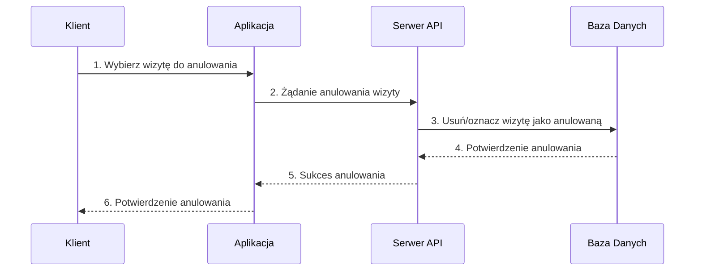

```mermaid
sequenceDiagram
    participant Klient
    participant Aplikacja
    participant SerwerAPI as Serwer API
    participant BazaDanych as Baza Danych

    Klient->>Aplikacja: 1. Wybierz wizytę do anulowania
    Aplikacja->>SerwerAPI: 2. Żądanie anulowania wizyty
    SerwerAPI->>BazaDanych: 3. Usuń/oznacz wizytę jako anulowaną
    BazaDanych-->>SerwerAPI: 4. Potwierdzenie anulowania
    SerwerAPI-->>Aplikacja: 5. Sukces anulowania
    Aplikacja-->>Klient: 6. Potwierdzenie anulowania
```