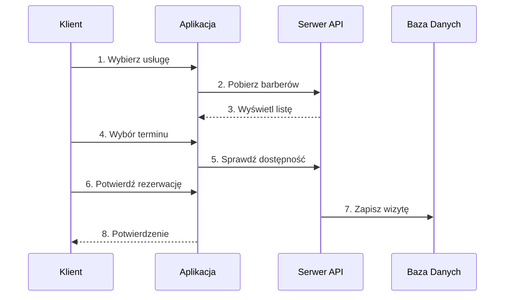

```mermaid
sequenceDiagram
    participant Klient
    participant Aplikacja
    participant SerwerAPI as Serwer API
    participant BazaDanych as Baza Danych

    Klient->>Aplikacja: 1. Wybierz usługę
    Aplikacja->>SerwerAPI: 2. Pobierz barberów
    SerwerAPI-->>Aplikacja: 3. Wyświetl listę
    Klient->>Aplikacja: 4. Wybór terminu
    Aplikacja->>SerwerAPI: 5. Sprawdź dostępność
    Klient->>Aplikacja: 6. Potwierdź rezerwację
    SerwerAPI->>BazaDanych: 7. Zapisz wizytę
    Aplikacja-->>Klient: 8. Potwierdzenie
```