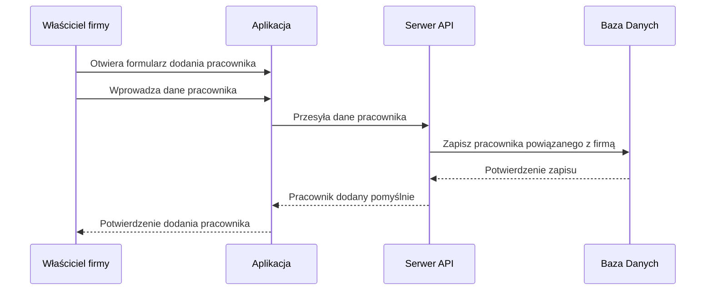

```mermaid
sequenceDiagram
    participant Właściciel as Właściciel firmy
    participant Aplikacja
    participant SerwerAPI as Serwer API
    participant BazaDanych as Baza Danych

    Właściciel->>Aplikacja: Otwiera formularz dodania pracownika
    Właściciel->>Aplikacja: Wprowadza dane pracownika
    Aplikacja->>SerwerAPI: Przesyła dane pracownika
    SerwerAPI->>BazaDanych: Zapisz pracownika powiązanego z firmą
    BazaDanych-->>SerwerAPI: Potwierdzenie zapisu
    SerwerAPI-->>Aplikacja: Pracownik dodany pomyślnie
    Aplikacja-->>Właściciel: Potwierdzenie dodania pracownika
```