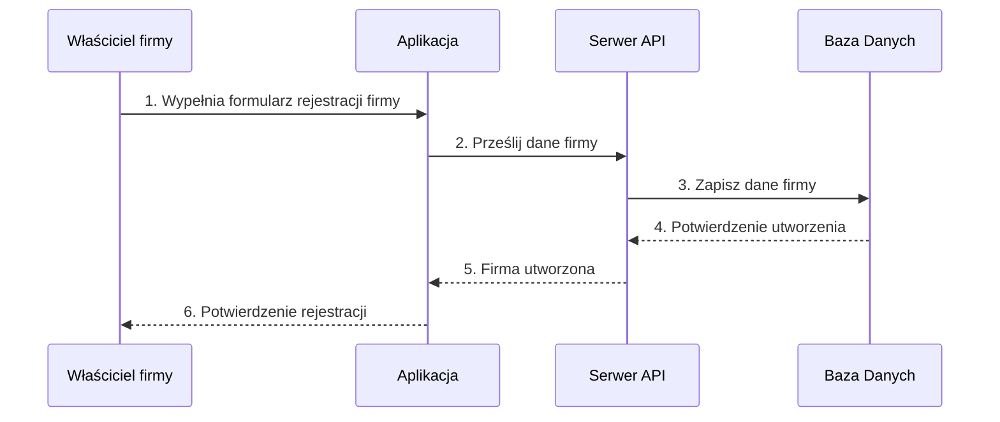

```mermaid
sequenceDiagram
    participant Właściciel as Właściciel firmy
    participant Aplikacja
    participant SerwerAPI as Serwer API
    participant BazaDanych as Baza Danych

    Właściciel->>Aplikacja: 1. Wypełnia formularz rejestracji firmy
    Aplikacja->>SerwerAPI: 2. Prześlij dane firmy
    SerwerAPI->>BazaDanych: 3. Zapisz dane firmy
    BazaDanych-->>SerwerAPI: 4. Potwierdzenie utworzenia
    SerwerAPI-->>Aplikacja: 5. Firma utworzona
    Aplikacja-->>Właściciel: 6. Potwierdzenie rejestracji
```