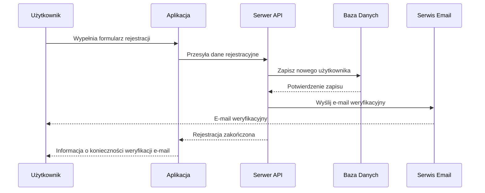

```mermaid
sequenceDiagram
    participant Użytkownik
    participant Aplikacja
    participant SerwerAPI as Serwer API
    participant BazaDanych as Baza Danych
    participant EmailService as Serwis Email

    Użytkownik->>Aplikacja: Wypełnia formularz rejestracji
    Aplikacja->>SerwerAPI: Przesyła dane rejestracyjne
    SerwerAPI->>BazaDanych: Zapisz nowego użytkownika
    BazaDanych-->>SerwerAPI: Potwierdzenie zapisu
    SerwerAPI->>EmailService: Wyślij e-mail weryfikacyjny
    EmailService-->>Użytkownik: E-mail weryfikacyjny
    SerwerAPI-->>Aplikacja: Rejestracja zakończona
    Aplikacja-->>Użytkownik: Informacja o konieczności weryfikacji e-mail
```